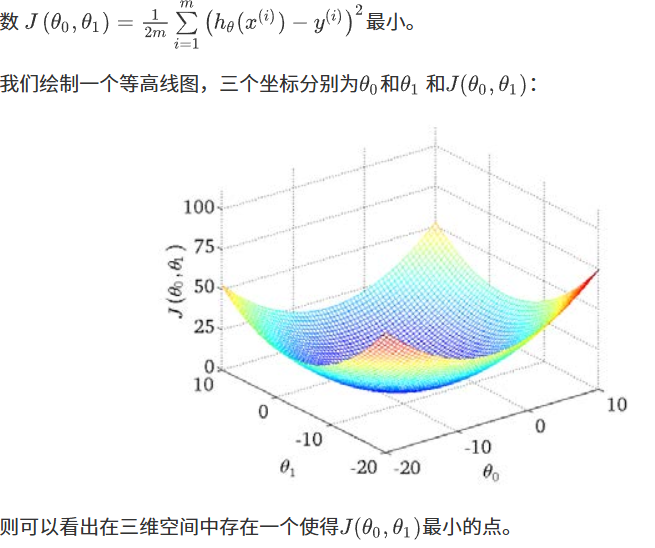

# 第一章

## 概要

重要参数经验E，任务T，性能度量P

监督学习（现成的数据去拟合预测）可以分为分类问题与回归问题

与无监督学习（无现成数据直接进行分类）聚类算法（鸡尾酒算法）

## 单变量线性回归

模型表示

拟合出最合适的答案，拟合成线性一次方程，中间有两个未知数，又由这两个未知数可以得出代价函数，求出最小值

## 梯度下降

求代价函数最小值

## 线性代数

# 第二章

## 多变量线性回归

$$ h_{\theta}(x) = \theta_0 + \theta_1 x_1 + \theta_2 x_2 + \dots + \theta_n x_n $$

代价函数

$$ J(\theta_0, \theta_1, \dots, \theta_n) = \frac{1}{2m} \sum_{i=1}^{m} \left( h_\theta(x^{(i)}) - y^{(i)} \right)^2 $$

回归的批量梯度下降算法为： 

$$ \begin{align*} &\text{Repeat } \{ \\ &\quad \theta_j := \theta_j - \alpha \frac{\partial}{\partial \theta_j} J(\theta_0, \theta_1, \dots, \theta_n) \\ &\} \end{align*} $$ 即： $$ \begin{align*} &\text{Repeat } \{ \\ &\quad \theta_j := \theta_j - \alpha \frac{\partial}{\partial \theta_j} \frac{1}{2m} \sum_{i=1}^{m} \left( h_\theta(x^{(i)}) - y^{(i)} \right)^2 \\ &\} \end{align*} $$ 求导数后得到： $$ \begin{align*} &\text{Repeat } \{ \\ &\quad \theta_j := \theta_j - \alpha \frac{1}{m} \sum_{i=1}^{m} \left( \left( h_\theta(x^{(i)}) - y^{(i)} \right) \cdot x_j^{(i)} \right) \\ &\quad (\text{simultaneously update } \theta_j \\ &\quad \text{for } j=0,1,\dots,n ) \\ &\} \end{align*} $$ 当 $n \ge 1$ 时： $$ \begin{align*} \theta_0 &:= \theta_0 - \alpha \frac{1}{m} \sum_{i=1}^{m} \left( h_\theta(x^{(i)}) - y^{(i)} \right) x_0^{(i)} \\ \theta_1 &:= \theta_1 - \alpha \frac{1}{m} \sum_{i=1}^{m} \left( h_\theta(x^{(i)}) - y^{(i)} \right) x_1^{(i)} \\ \theta_2 &:= \theta_2 - \alpha \frac{1}{m} \sum_{i=1}^{m} \left( h_\theta(x^{(i)}) - y^{(i)} \right) x_2^{(i)} \end{align*} $$

## 特征放缩

放缩到同一尺度$$ x_n = \frac{x_n - \mu_n}{s_n} $$ 其中 $\mu_n$ 是平均值，$s_n$ 是标准差。

## 特征与多项式回归

不一定都是一次方程

## 正规方程（前提是可逆矩阵）

  ($\theta \in \mathbb{R}$) $$ J(\theta) = a\theta^2 + b\theta + c $$  $$ \frac{\partial}{\partial \theta_j} J(\theta_j) = 0 $$ 

假设我们的训练集特征矩阵为 $X$（包含了 $x_0=1$）并且我们的训练集结果为向量 $y$，则利用正规方程解出向量： $$ \theta = (X^T X)^{-1} X^T y $$ 上标 $T$ 代表矩阵转置，上标 $-1$ 代表矩阵的逆。

设矩阵 $A = X^T X$，则：$(X^T X)^{-1} = A^{-1}$ 以下表示数据为例：

 **Examples: $m=4$** 

| X(0) | X(1) | X(2) | X(3) | X(4) | y    |
| ---- | ---- | ---- | ---- | ---- | ---- |
| 1    | 2104 | 5    | 1    | 45   | 460  |
| 1    | 1416 | 3    | 2    | 40   | 232  |
| 1    | 1534 | 3    | 2    | 30   | 315  |
| 1    | 852  | 2    | 1    | 36   | 178  |
|      |      |      |      |      |      |

$$ \theta = \left( \begin{bmatrix} 1 & 1 & 1 & 1 \\ 2104 & 1416 & 1534 & 852 \\ 5 & 3 & 3 & 2 \\ 1 & 2 & 2 & 1 \\ 45 & 40 & 30 & 36 \end{bmatrix} \times \begin{bmatrix} 1 & 2104 & 5 & 1 & 45 \\ 1 & 1416 & 3 & 2 & 40 \\ 1 & 1534 & 3 & 2 & 30 \\ 1 & 852 & 2 & 1 & 36 \end{bmatrix} \right)^{-1} \times \begin{bmatrix} 1 & 1 & 1 & 1 \\ 2104 & 1416 & 1534 & 852 \\ 5 & 3 & 3 & 2 \\ 1 & 2 & 2 & 1 \\ 45 & 40 & 30 & 36 \end{bmatrix} \times \begin{bmatrix} 460 \\ 232 \\ 315 \\ 178 \end{bmatrix} $$

# 第三章

## 分类问题

不需要连续的值

逻辑回归

$$ h_\theta(x) = g\left(\theta^T X\right) $$（h预测值，）

$$ g(z) = \frac{1}{1 + e^{-z}} $$

拟合$\theta$,如果代入线性的代价函数得到

线性回归的代价函数为： $$ J(\theta) = \frac{1}{m} \sum_{i=1}^{m} \frac{1}{2} \left( h_\theta(x^{(i)}) - y^{(i)} \right)^2 $$ 我们重新定义逻辑回归的代价函数为： $$ J(\theta) = \frac{1}{m} \sum_{i=1}^{m} Cost\left( h_\theta(x^{(i)}), y^{(i)} \right) $$ 其中 $$ Cost(h_\theta(x), y) = \begin{cases} -\log(h_\theta(x)) & \text{if } y = 1 \\ -\log(1 - h_\theta(x)) & \text{if } y = 0 \end{cases} $$

这样构建的 $Cost(h_\theta(x), y)$ 函数的特点是：

- 当实际的 $y=1$ 且 $h_\theta(x)$ 也为 1 时误差为 0，当 $y=1$ 但 $h_\theta(x)$ 不为 1 时误差随着 $h_\theta(x)$ 变小而变大；
-  当实际的 $y=0$ 且 $h_\theta(x)$ 也为 0 时代价为 0，当 $y=0$ 但 $h_\theta(x)$ 不为 0 时误差随着 $h_\theta(x)$ 的变大而变大。 将构建的 $Cost(h_\theta(x), y)$ 简化如下： $$ Cost(h_\theta(x), y) = -y \times \log(h_\theta(x)) - (1-y) \times \log(1-h_\theta(x)) $$ 带入代价函数得到： $$ J(\theta) = \frac{1}{m} \sum_{i=1}^{m} \left[ -y^{(i)} \log(h_\theta(x^{(i)})) - (1-y^{(i)}) \log(1-h_\theta(x^{(i)})) \right] $$ 即： $$ J(\theta) = -\frac{1}{m} \sum_{i=1}^{m} \left[ y^{(i)} \log(h_\theta(x^{(i)})) + (1-y^{(i)}) \log(1-h_\theta(x^{(i)})) \right] $$

Repeat {     $\theta_j := \theta_j - \alpha \frac{\partial}{\partial \theta_j} J(\theta)$ (simultaneously update all)  } 求导后得到： Repeat {     $\theta_j := \theta_j - \alpha \frac{1}{m} \sum_{i=1}^{m} \left( h_\theta(x^{(i)}) - y^{(i)} \right) x_j^{(i)}$ (simultaneously update all)  }

**共轭梯度**（**Conjugate Gradient**），**局部优化法**(**Broyden fletcher goldfarb shann,BFGS**)和**有限内存局部优化法**(**LBFGS**) ，**fminunc**是 **matlab**和**octave** 中都带的一个最小值优化函数，使用时我们需要提供代价函数和每个参数的求导

高级优化

事实上，他们确实有一个智能的内部循环，称为**线性搜索**(**line search**)算法，它可以自动尝试不同的学习速率 ，并自动选择一个好的学习速率

## 多类别分类一对多

多次分类设其中一个为1其余为0，多次循环

## 正则化

x次数越高越拟合但会丧失功能，可以选择保留一部分或者模型选择pca或者正则化，正则化就是将高次项系数尽可能减小，修改代价函数（增加高系数的惩罚）

## 正则化线性回归

正则化线性回归的代价函数为： $$ J(\theta) = \frac{1}{2m} \sum_{i=1}^{m} \left[ \left( h_\theta(x^{(i)}) - y^{(i)} \right)^2 + \lambda \sum_{j=1}^{n} \theta_j^2 \right] $$

如果我们要使用梯度下降法令这个代价函数最小化，因为我们未对 $\theta_0$ 进行正则化，所以梯度下降算法将分两种情形： $$ \begin{align*} &\text{Repeat until convergence \{ } \\ & \quad \theta_0 := \theta_0 - \alpha \frac{1}{m} \sum_{i=1}^{m} \left( (h_\theta(x^{(i)}) - y^{(i)}) x_0^{(i)} \right) \\ & \quad \theta_j := \theta_j - \alpha \left[ \frac{1}{m} \sum_{i=1}^{m} \left( (h_\theta(x^{(i)}) - y^{(i)}) x_j^{(i)} \right) + \frac{\lambda}{m} \theta_j \right] \\ & \quad \text{for } j = 1,2,\dots,n \\ & \} \end{align*} $$

我们同样也可以利用正规方程来求解正则化线性回归模型，方法如下所示： $$ \theta = \left( X^T X + \lambda \begin{bmatrix} 0 & & & \\ & 1 & & \\ & & 1 & \\ & & & \ddots & \\ & & & & 1 \end{bmatrix} \right)^{-1} X^T y $$ 图中的矩阵尺寸为 $(n+1) \times (n+1)$。

## 正则化逻辑回归模型

自己计算导数同样对于逻辑回归，我们也给代价函数增加一个正则化的表达式，得到代价函数： $$ J(\theta) = \frac{1}{m} \sum_{i=1}^{m} \left[ -y^{(i)} \log(h_\theta(x^{(i)})) - (1-y^{(i)}) \log(1-h_\theta(x^{(i)})) \right] + \frac{\lambda}{2m} \sum_{j=1}^{n} \theta_j^2 $$

要最小化该代价函数，通过求导，得出梯度下降算法为： $$ \begin{align*} &\text{Repeat until convergence \{ } \\ & \quad \theta_0 := \theta_0 - \alpha \frac{1}{m} \sum_{i=1}^{m} \left( (h_\theta(x^{(i)}) - y^{(i)}) x_0^{(i)} \right) \\ & \quad \theta_j := \theta_j - \alpha \left[ \frac{1}{m} \sum_{i=1}^{m} (h_\theta(x^{(i)}) - y^{(i)}) x_j^{(i)} + \frac{\lambda}{m} \theta_j \right] \\ & \quad \text{for } j = 1, 2, \dots, n \\ & \} \end{align*} $$ 注：看上去同线性回归一样，但是知道 $h_\theta(x) = g(\theta^T X)$，所以与线性回归不同。

# 第四章

## 神经网络

讲一个行为拆解成多个特征，层层传递叠加，再由特征通过某种计算得到最后的值即判断。

可以借此实现多类分类

# 第五章

## 神经网络

代价函数

我们回顾逻辑回归问题中我们的代价函数为： $$ J(\theta) = -\frac{1}{m} \left[ \sum_{i=1}^{m} y^{(i)} \log h_\theta(x^{(i)}) + (1-y^{(i)}) \log(1-h_\theta(x^{(i)})) \right] + \frac{\lambda}{2m} \sum_{j=1}^{n} \theta_j^2 $$ 在逻辑回归中，我们只有一个输出变量，又称标量（scalar），也只有一个因变量 $y$，但是在神经网络中，我们可以有很多输出变量，我们的 $h_\theta(x)$ 是一个维度为 $K$ 的向量，并且我们训练集中的因变量也是同样维度的一个向量，因此我们的代价函数会比逻辑回归更加复杂一些，为： $$ h_\theta(x) \in \mathbb{R}^K $$ $$ (h_\theta(x))_i = i^{th} \text{ output} $$ $$ J(\Theta) = -\frac{1}{m} \left[ \sum_{i=1}^{m} \sum_{k=1}^{K} y_k^{(i)} \log(h_\Theta(x^{(i)}))_k + (1-y_k^{(i)}) \log(1-(h_\Theta(x^{(i)}))_k) \right] + \frac{\lambda}{2m} \sum_{l=1}^{L-1} \sum_{i=1}^{s_l} \sum_{j=1}^{s_{l+1}} \left( \Theta_{ji}^{(l)} \right)^2 $$

反向传播

梯度检验

随机初始化

# 第六章

## 流程问题

1. 获得更多的训练样本——通常是有效的，但代价较大，下面的方法也可能有效，可考虑先采用下面的几种方法。
2. 尝试减少特征的数量
3. 尝试获得更多的特征
4. 尝试增加多项式特征
5. 尝试减少正则化程度
6. 尝试增加正则化程度

分出训练集（0.7）和测试集（0.3），使用测试集来进行计算代价函数

有两种方式计算误差：

1. 对于线性回归模型，我们利用测试集数据计算代价函数 $J$。
2. 对于逻辑回归模型，我们除了可以利用测试数据集来计算代价函数外： $$ J_{test}(\theta) = -\frac{1}{m_{test}} \sum_{i=1}^{m_{test}} \left[ y_{test}^{(i)} \log h_\theta(x_{test}^{(i)}) + (1 - y_{test}^{(i)}) \log(1 - h_\theta(x_{test}^{(i)})) \right] $$ 也可以计算误分类的比率，对于每一个测试集样本，计算： $$ err(h_\theta(x), y) = \begin{cases} 1 & \text{if } h(x) \ge 0.5 \text{ and } y = 0, \text{ or if } h(x) < 0.5 \text{ and } y = 1 \\ 0 & \text{Otherwise} \end{cases} $$ 然后对计算结果求平均。

模型选择与交叉验证，训练集（0.6）交叉数据验证集(0.2),测试集（0.2），

测试集选择办法：先用0.6的训练集训练，用0.2的交叉训练值算代价函数，算出最小的情况，用测试集所选用的函数算代价函数

训练集误差和交叉验证集误差近似时：偏差/欠拟合 交叉验证集误差远大于训练集误差时：方差/过拟合

## 学习曲线

高偏差/欠拟合的情况下，增加数据到训练集不一定能有帮助。假设我们使用一个非常高次的多项式模型，并且正则化非常小，可以看出，当交叉验证集误差远大于训练集误差时，往训练集增加更多数据可以提高模型的效果。

## 下一步

1. 获得更多的训练样本——解决高方差
2. 尝试减少特征的数量——解决高方差
3. 尝试获得更多的特征——解决高偏差
4. 尝试增加多项式特征——解决高偏差
5. 尝试减少正则化程度λ——解决高偏差
6. 尝试增加正则化程度λ——解决高方差

# 第七章

## 向量机SVM

$$ h_{\theta}(x) = \frac{1}{1 + e^{-\theta^T x}} $$

If $y = 1$, we want $h_\theta(x) \approx 1$, $\quad \theta^T x \gg 0$   

If $y = 0$, we want $h_\theta(x) \approx 0$, $\quad \theta^T x \ll 0$

cost函数

$$-\left(y \log h_\theta(x)+(1-y)\log(1-h_\theta(x))\right)) $$

$$ = -y \log \frac{1}{1 + e^{-\theta^T x}} - (1-y)\log\left(1 - \frac{1}{1 + e^{-\theta^T x}}\right) $$

若y=1 只剩前半部分，y=0只剩后面一部分

$$ J(\theta) = \frac{1}{m} \sum_{i=1}^{m} \left[ -y^{(i)} \log(h_\theta(x^{(i)})) - (1-y^{(i)}) \log(1-h_\theta(x^{(i)})) \right] $$ 即： $$ J(\theta) = -\frac{1}{m} \sum_{i=1}^{m} \left[ y^{(i)} \log(h_\theta(x^{(i)})) + (1-y^{(i)}) \log(1-h_\theta(x^{(i)})) \right] $$

令y=1

$= -y \log \frac{1}{1 + e^{-\theta^T x}}$ 

则更希望z》1这样损失函数更接近0

## 核函数

# 第八章

## 聚类（无监督学习）

k-均值算法

先选k个随机点称为聚类中心，算出距离，近的为一组。

k均值代价函数

$$ J\left(c^{(1)}, \dots, c^{(m)}, \mu_1, \dots, \mu_K\right) = \frac{1}{m} \sum_{i=1}^m \left\| X^{(i)} - \mu_{c^{(i)}} \right\|^2 $$

其中 $\mu_{c^{(i)}}$ 代表与 $x^{(i)}$ 最近的聚类中心点，我们的目标是： $$ J\left(c^{(1)}, \dots, c^{(m)}, \mu_1, \dots, \mu_K\right) = \frac{1}{m} \sum_{i=1}^m \left\| X^{(i)} - \mu_{c^{(i)}} \right\|^2 $$ $$ \min_{\substack{c^{(1)},\dots,c^{(m)}, \\ \mu_1,\dots,\mu_K}} J\left(c^{(1)},\dots,c^{(m)},\mu_1,\dots,\mu_K\right) $$

m：样本总数

K：簇的数量

X(i)：第 i 个样本

c(i)：第 i 个样本所属簇的索引

μk：第 k 个簇的中心

J：失真代价函数，衡量聚类效果好坏，越小越好

随机初始化->随机选k个实例使k个聚类中心与k个训练实例相等（只适用于k比较小）

肘部法则

选择开始变得平缓的点

1. 相似度/距离计算方法总结 

(1). 闵可夫斯基距离 Minkowski （其中欧式距离：$p=2$） $$ dist(X,Y) = \left( \sum_{i=1}^{n} |x_i - y_i|^p \right)^{\frac{1}{p}} $$ ---

 (2). 杰卡德相似系数 Jaccard $$ J(A,B) = \frac{|A \cap B|}{|A \cup B|} $$ ---

(3). 余弦相似度 cosine similarity n 维向量 $x$ 和 $y$ 的夹角记做 $\theta$，根据余弦定理，其余弦值为： $$ \cos(\theta) = \frac{x^T y}{|x| \cdot |y|} = \frac{\sum_{i=1}^n x_i y_i}{\sqrt{\sum_{i=1}^n x_i^2} \sqrt{\sum_{i=1}^n y_i^2}} $$ ---

 (4). Pearson 皮尔逊相关系数 $$ \rho_{XY} = \frac{\text{cov}(X,Y)}{\sigma_X \sigma_Y} = \frac{E[(X-\mu_X)(Y-\mu_Y)]}{\sigma_X \sigma_Y} = \frac{\sum_{i=1}^n (x-\mu_X)(y-\mu_Y)}{\sqrt{\sum_{i=1}^n (x-\mu_X)^2} \sqrt{\sum_{i=1}^n (y-\mu_Y)^2}} $$ > Pearson 相关系数即将 $x$、$y$ 坐标向量各自平移到原点后的夹角余弦。

聚类的衡量指标 

 (1). 均一性（p） 类似于精确率，一个簇中只包含一个类别的样本，则满足均一性。也可以理解为正确率（每个聚类中正确分类的样本数占该聚类总样本数的比例和）。

(2). 完整性（r） 类似于召回率，同类样本被归类到相同簇中，则满足完整性。每个聚类中正确分类的样本数占该类型的总样本数比例的和。

(3). V-measure 均一性和完整性的加权平均： $$ V = \frac{(1+\beta^2) \cdot p \cdot r}{\beta^2 \cdot p + r} $$ 

 (4). 轮廓系数 样本 $i$ 的轮廓系数：$s(i)$ - **簇内不相似度**：计算样本 $i$ 到同簇其它样本的平均距离为 $a(i)$，应尽可能小。 - **簇间不相似度**：计算样本 $i$ 到其它簇 $C_j$ 的所有样本的平均距离 $b_{ij}$，应尽可能大。 轮廓系数：$s(i)$ 值越接近 1 表示样本 $i$ 聚类越合理；越接近 -1，表示样本 $i$ 应该分类到另外的簇中；近似为 0，表示样本 $i$ 应该在边界上；所有样本的 $s(i)$ 的均值被成为聚类结果的轮廓系数。 $$ s(i) = \frac{b(i) - a(i)}{\max\{a(i), b(i)\}} $$ 

 (5). ARI（调整兰德指数） 数据集 $S$ 共有 $N$ 个元素，两个聚类结果分别是： $$ X = \{X_1, X_2, \dots, X_r\}, \quad Y = \{Y_1, Y_2, \dots, Y_s\} $$ $X$ 和 $Y$ 的元素个数为： $$ a = \{a_1, a_2, \dots, a_r\}, \quad b = \{b_1, b_2, \dots, b_s\} $$ 记：$n_{ij} = |X_i \cap Y_j|$ $$ ARI = \frac{\sum_{ij} C_{n_{ij}}^2 - \left[ \left( \sum_i C_{a_i}^2 \right) \cdot \left( \sum_i C_{b_i}^2 \right) \right] / C_n^2}{\frac{1}{2} \left[ \left( \sum_i C_{a_i}^2 \right) + \left( \sum_i C_{b_i}^2 \right) \right] - \left[ \left( \sum_i C_{a_i}^2 \right) \cdot \left( \sum_i C_{b_i}^2 \right) \right] / C_n^2} $$

## 降维

数据压缩，数据可视化。

pca主成分分析

归一化->计算协方差矩阵->计算协方差特征向量

选择主成分数量

# 第九章

异常检测可以通过密度估计

高斯分布

保存一些正常值，然后可以估算现在给出数据正确的概率

通常如果我们认为变量 $x$ 符合高斯分布 $x \sim N(\mu, \sigma^2)$，则其概率密度函数为： $$ p(x; \mu, \sigma^2) = \frac{1}{\sqrt{2\pi}\sigma} \exp\left(-\frac{(x-\mu)^2}{2\sigma^2}\right) $$ 我们可以利用已有的数据来预测总体中的 $\mu$ 和 $\sigma^2$，计算方法如下： $$ \mu = \frac{1}{m} \sum_{i=1}^m x^{(i)} $$ （注：图片下方还有 $\sigma^2$ 的估计公式，因被截断未显示，完整形式为： $$ \sigma^2 = \frac{1}{m} \sum_{i=1}^m (x^{(i)} - \mu)^2 $$ ）

推荐系统

协同过滤

既没有用户的参数，也没有电影的特征，这两种方法都不可行了。协同过滤算法可以同时学习这两者。

我们的优化目标便改为同时针对 $x$ 和 $\theta$ 进行。 $$ J\left(x^{(1)},\dots,x^{(n_m)},\theta^{(1)},\dots,\theta^{(n_u)}\right) = \frac{1}{2} \sum_{(i,j):r(i,j)=1} \left( (\theta^{(j)})^T x^{(i)} - y^{(i,j)} \right)^2 + \frac{\lambda}{2} \sum_{i=1}^{n_m} \sum_{k=1}^n (x_k^{(j)})^2 + \frac{\lambda}{2} \sum_{j=1}^{n_u} \sum_{k=1}^n (\theta_k^{(j)})^2 $$ 对代价函数求偏导数的结果如下： $$ x_k^{(i)} := x_k^{(i)} - \alpha \left( \sum_{j:r(i,j)=1} \left( (\theta^{(j)})^T x^{(i)} - y^{(i,j)} \right) \theta_k^{(j)} + \lambda x_k^{(i)} \right) $$ $$ \theta_k^{(j)} := \theta_k^{(j)} - \alpha \left( \sum_{i:r(i,j)=1} \left( (\theta^{(j)})^T x^{(i)} - y^{(i,j)} \right) x_k^{(i)} + \lambda \theta_k^{(j)} \right) $$

向量化：低秩矩阵分解

均值归一化

# 第十章

## 大规模机器学习

随机梯度下降法

小批量梯度下降

随机梯度下降收敛
